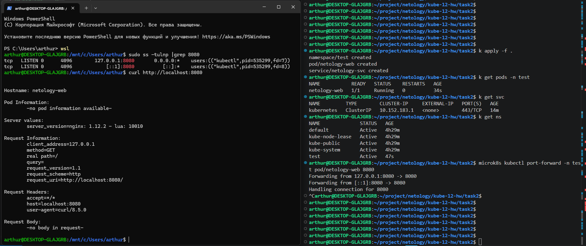

# Домашнее задание к занятию «Базовые объекты K8S»

### Цель задания

В тестовой среде для работы с Kubernetes, установленной в предыдущем ДЗ, необходимо развернуть Pod с приложением и подключиться к нему со своего локального компьютера. 

------

### Чеклист готовности к домашнему заданию

1. Установленное k8s-решение (например, MicroK8S).
2. Установленный локальный kubectl.
3. Редактор YAML-файлов с подключенным Git-репозиторием.

------

### Инструменты и дополнительные материалы, которые пригодятся для выполнения задания

1. Описание [Pod](https://kubernetes.io/docs/concepts/workloads/pods/) и примеры манифестов.
2. Описание [Service](https://kubernetes.io/docs/concepts/services-networking/service/).

------

### Задание 1. Создать Pod с именем hello-world

1. Создать манифест (yaml-конфигурацию) Pod.
2. Использовать image - gcr.io/kubernetes-e2e-test-images/echoserver:2.2.
3. Подключиться локально к Pod с помощью `kubectl port-forward` и вывести значение (curl или в браузере).

------

### Задание 2. Создать Service и подключить его к Pod

1. Создать Pod с именем netology-web.
2. Использовать image — gcr.io/kubernetes-e2e-test-images/echoserver:2.2.
3. Создать Service с именем netology-svc и подключить к netology-web.
4. Подключиться локально к Service с помощью `kubectl port-forward` и вывести значение (curl или в браузере).

------

### Правила приёма работы

1. Домашняя работа оформляется в своем Git-репозитории в файле README.md. Выполненное домашнее задание пришлите ссылкой на .md-файл в вашем репозитории.
2. Файл README.md должен содержать скриншоты вывода команд `kubectl get pods`, а также скриншот результата подключения.
3. Репозиторий должен содержать файлы манифестов и ссылки на них в файле README.md.

------

### Критерии оценки
Зачёт — выполнены все задания, ответы даны в развернутой форме, приложены соответствующие скриншоты и файлы проекта, в выполненных заданиях нет противоречий и нарушения логики.

На доработку — задание выполнено частично или не выполнено, в логике выполнения заданий есть противоречия, существенные недостатки.

------

# Решение

## Задание 1. Создать Pod с именем hello-world

Во-первых, несколько полезных команд:

```bash
sudo microk8s stop
sudo microk8s start
sudo microk8s status
```
Это минимальный набор для передёргивания кластера и просмотра статуса.
Если видим, что что-то идёт не так, то используем. Максимально подробно с подсказками

```bash
microk8s inspect
```

Почему-то пришлось несколько раз переустанавливать. Обязательно перезагрузка машины. И вот эта команда помогла:
```bash
sudo microk8s reset --destroy-storage
```
Она чистит снапшот snap, который сохраняется и используется при переустановке приложения.
Может помочь и вот такой вариант
```bash
snap remove --purge.
``` 

А затем 
```bash
sudo snap remove microk8s
sudo snap install microk8s --classic
sudo microk8s status --wait-ready
```
Запускаем pod
```bash
microk8s kubectl apply -f pod.yaml
```
Смотрим pod
```bash
microk8s kubectl get pods
```

Подключаемся к pod
```bash
kubectl port-forward -n test pod/netology-web 8080:8080
```

Результат: 



### Задание 2. Создать Service и подключить его к Pod

Добавил alias для удобства
```bash
alias k='k8s kubectl'
alias k8s='microk8s'
```

Если все файлы лежат в одном каталоге и очередность определена с помощью имени, то проект можно запускать и так:
```bash
k apply -f .
```

После запуска, можем посмотреть наши pod, service и namespace
```bash
k get pods
k get services
k get namespace
```

Подключаемся к pod
```bash
k port-forward -n test pod/netology-web 8080:8080
```
Результат: 
